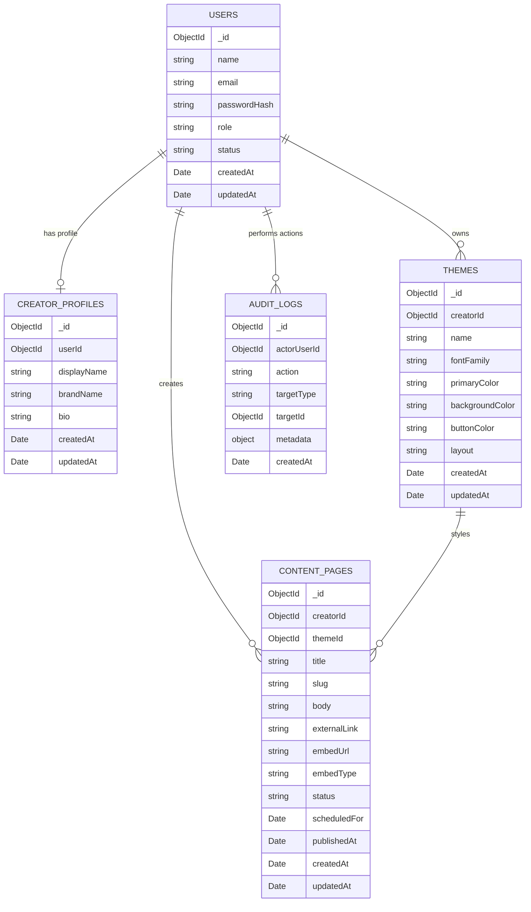

## MongoDB Collection Relationship Diagram

```mermaid
erDiagram
    USERS ||--o| CREATOR_PROFILES : "has profile"
    USERS ||--o{ CONTENT_PAGES : "creates"
    USERS ||--o{ THEMES : "owns"
    USERS ||--o{ AUDIT_LOGS : "performs actions"
    THEMES ||--o{ CONTENT_PAGES : "styles"

    USERS {
        ObjectId _id
        string name
        string email
        string passwordHash
        string role
        string status
        Date createdAt
        Date updatedAt
    }

    CREATOR_PROFILES {
        ObjectId _id
        ObjectId userId
        string displayName
        string brandName
        string bio
        Date createdAt
        Date updatedAt
    }

    CONTENT_PAGES {
        ObjectId _id
        ObjectId creatorId
        ObjectId themeId
        string title
        string slug
        string body
        string externalLink
        string embedUrl
        string embedType
        string status
        Date scheduledFor
        Date publishedAt
        Date createdAt
        Date updatedAt
    }

    THEMES {
        ObjectId _id
        ObjectId creatorId
        string name
        string fontFamily
        string primaryColor
        string backgroundColor
        string buttonColor
        string layout
        Date createdAt
        Date updatedAt
    }

    AUDIT_LOGS {
        ObjectId _id
        ObjectId actorUserId
        string action
        string targetType
        ObjectId targetId
        object metadata
        Date createdAt
    }
```