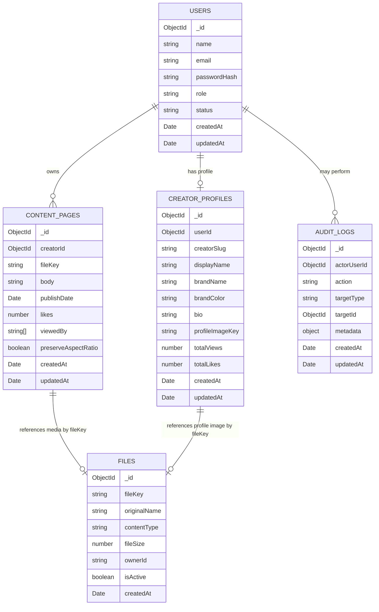

# Database - Data Model

This page gives a high-level view of the current MongoDB document relationships used by Tapitude Creator Hub.

The app uses MongoDB through Mongoose. This is not a traditional relational ERD, but the documents do reference each other by id.

## Current Main Collections

## Relationship Summary

- A `User` can be an admin or creator.
- A creator `User` has one `CreatorProfile`.
- A creator `User` owns many `ContentPage` documents.
- A `ContentPage` can reference one uploaded file through `fileKey`.
- A `CreatorProfile` can reference one profile image through `profileImageKey`.
- Uploaded file metadata is stored in `File` documents.
- Physical uploaded files are stored in the local `storage/` folder during development.

## Analytics Model

The current app stores basic analytics directly on existing documents:

- `CreatorProfile.totalViews`
- `CreatorProfile.totalLikes`
- `ContentPage.likes`
- `ContentPage.viewedBy`

Older wiki references to an `analytics_events` collection should be treated as future planning, not current implementation.

## Known Model Cleanup

Review and reconcile `ContentPage.status`.

Current controllers and views reference `status`, while the inspected `ContentPage` schema is centered on `publishDate`. This should be resolved before the app is considered final.

